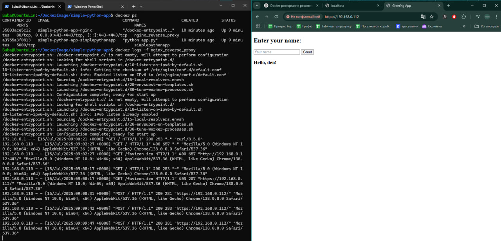
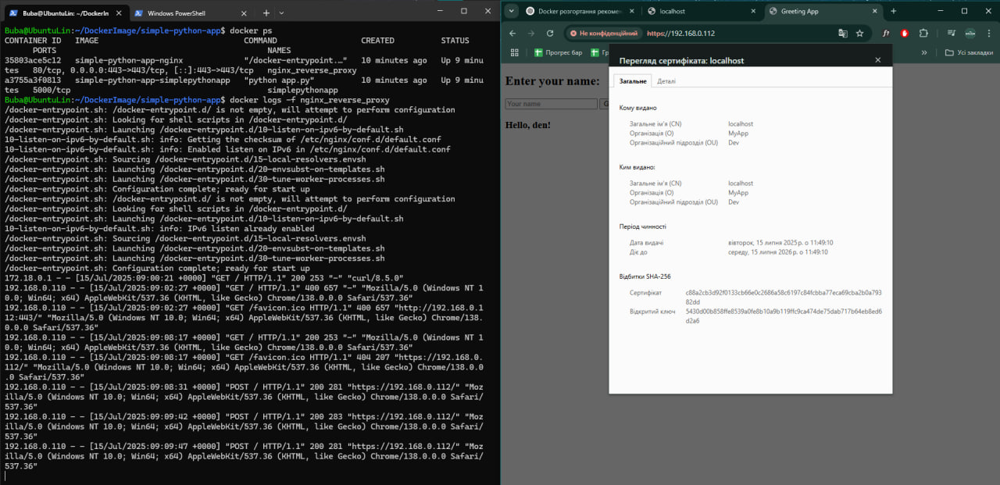

# Simple Python Flask App in Docker

This project contains a simple Python Flask application running inside Docker containers.

## Description

- Flask application that responds to HTTP requests and returns a greeting form.
- The Docker image uses the latest stable Python version (`python:3.13.5-slim`).
- The application is served behind an Nginx reverse proxy with HTTPS enabled.
- Nginx is configured with a **self-signed SSL certificate** for secure connections.
- The setup uses Docker Compose to orchestrate the Flask app and Nginx containers.
- Port **443** is exposed for HTTPS access, proxying requests to Flask on port 5000 internally.

## Requirements

- Docker and Docker Compose installed.
- `make` command available.

## Usage

- Create image:
bash -> make build

- Start image:
bash -> make run

- Clean and stop image:
bash -> make clean

After starting the container, the application will be available at:
http://localhost:5000

## Screenshots

License
MIT
